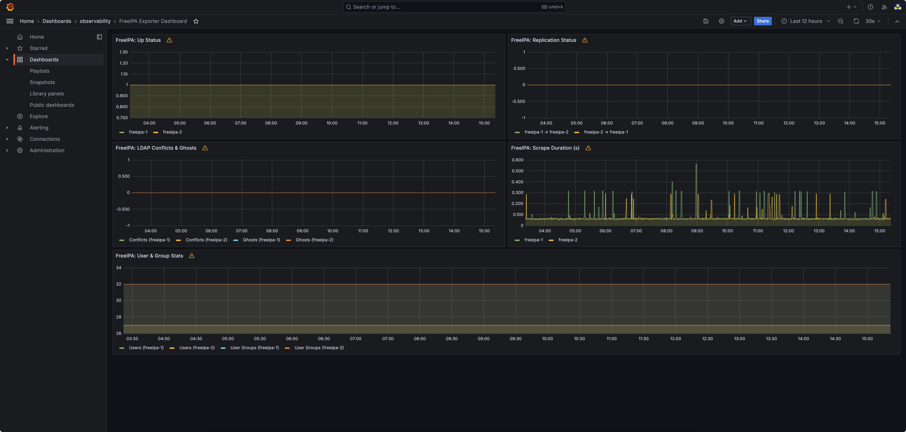

# FreeIPA Prometheus Exporter

Here's a Kubernetes deployment manifest for the FreeIPA Prometheus Exporter, including the ServiceMonitor, PrometheusRule, Runbook and Grafana Dashboard with all environment variables securely fetched from a Kubernetes Secret managed by External Secrets Operator:

### Step 1: Create ExternalSecret

```yaml
apiVersion: external-secrets.io/v1beta1
kind: ExternalSecret
metadata:
  name: freeipa-exporter-secret
  namespace: monitoring
spec:
  refreshInterval: 30m
  secretStoreRef:
    kind: ClusterSecretStore
    name: infra-secret-store
  target:
    name: freeipa-exporter-secret
    template:
      data:
        FREEIPA_DOMAIN: "{{ .freeipa_domain }}"
        FREEIPA_BIND_DN: "{{ .freeipa_bind_dn }}"
        FREEIPA_BIND_PW: "{{ .freeipa_bind_pw }}"
        FREEIPA_HOSTS: "{{ .freeipa_hosts }}"
        CACHE_TTL: "{{ .cache_ttl }}"
  data:
    - secretKey: freeipa_domain
      remoteRef:
        key: aws-prod-infra/freeipa/secrets
        property: FREEIPA_DOMAIN
    - secretKey: freeipa_bind_dn
      remoteRef:
        key: aws-prod-infra/freeipa/secrets
        property: FREEIPA_BIND_DN
    - secretKey: freeipa_bind_pw
      remoteRef:
        key: aws-prod-infra/freeipa/secrets
        property: FREEIPA_BIND_PW
    - secretKey: freeipa_hosts
      remoteRef:
        key: aws-prod-infra/freeipa/secrets
        property: FREEIPA_HOSTS
    - secretKey: cache_ttl
      remoteRef:
        key: aws-prod-infra/freeipa/secrets
        property: CACHE_TTL
```

### Step 1: Create Secret (Optional alternative to ExternalSecret)

If you're not using External Secrets Operator, create a native Kubernetes Secret:

```yaml
apiVersion: v1
kind: Secret
metadata:
  name: freeipa-exporter-secret
  namespace: monitoring
type: Opaque
data:
  FREEIPA_DOMAIN: <base64-encoded-domain>
  FREEIPA_BIND_DN: <base64-encoded-bind-dn>
  FREEIPA_BIND_PW: <base64-encoded-password>
  FREEIPA_HOSTS: <base64-encoded-hosts>
  CACHE_TTL: <base64-encoded-cache-ttl>
```

Encode values with:

```bash
echo -n 'your_value' | base64
```

### Step 2: Create Kubernetes Deployment

```yaml
apiVersion: apps/v1
kind: Deployment
metadata:
  name: freeipa-exporter
  namespace: monitoring
  labels:
    app: freeipa-exporter
spec:
  replicas: 1
  selector:
    matchLabels:
      app: freeipa-exporter
  template:
    metadata:
      labels:
        app: freeipa-exporter
    spec:
      containers:
        - name: freeipa-exporter
          image: freeipa-exporter:latest
          imagePullPolicy: IfNotPresent
          ports:
            - containerPort: 9189
          envFrom:
            - secretRef:
                name: freeipa-exporter-secret
          livenessProbe:
            httpGet:
              path: /health
              port: 9189
            initialDelaySeconds: 5
            periodSeconds: 10
          readinessProbe:
            httpGet:
              path: /health
              port: 9189
            initialDelaySeconds: 5
            periodSeconds: 10
          resources:
            requests:
              cpu: 100m
              memory: 128Mi
            limits:
              cpu: 250m
              memory: 256Mi
```

### Step 3: Create Service

```yaml
apiVersion: v1
kind: Service
metadata:
  name: freeipa-exporter
  namespace: monitoring
  labels:
    app: freeipa-exporter
spec:
  type: ClusterIP
  ports:
    - port: 9189
      targetPort: 9189
      protocol: TCP
      name: metrics
  selector:
    app: freeipa-exporter
```

### Step 4: Create ServiceMonitor

```yaml
apiVersion: monitoring.coreos.com/v1
kind: ServiceMonitor
metadata:
  name: freeipa-exporter
  namespace: monitoring
  labels:
    app: freeipa-exporter
spec:
  selector:
    matchLabels:
      app: freeipa-exporter
  endpoints:
    - port: metrics
      interval: 60s
      path: /metrics
```

### Step 5: Create PrometheusRule

```yaml
apiVersion: monitoring.coreos.com/v1
kind: PrometheusRule
metadata:
  name: freeipa-exporter-alerts
  namespace: monitoring
  labels:
    app: freeipa-exporter
spec:
  groups:
    - name: freeipa.rules
      rules:
        - alert: FreeIPAInstanceDown
          expr: ipa_up == 0
          for: 2m
          labels:
            severity: critical
          annotations:
            summary: "FreeIPA instance down ({{ $labels.host }})"
            description: "The exporter cannot scrape metrics from FreeIPA instance {{ $labels.host }}."

        - alert: FreeIPAReplicationError
          expr: ipa_replication_status == 1
          for: 1m
          labels:
            severity: critical
          annotations:
            summary: "Replication issue from {{ $labels.source }} to {{ $labels.target }}"
            description: "FreeIPA replication status is failing between {{ $labels.source }} and {{ $labels.target }}."

        - alert: FreeIPAAnonymousBindEnabled
          expr: ipa_bind == 1
          for: 5m
          labels:
            severity: warning
          annotations:
            summary: "Anonymous BIND is enabled on {{ $labels.host }}"
            description: "Anonymous BIND should be disabled for security reasons. Check FreeIPA server {{ $labels.host }}."

        - alert: FreeIPALDAPConflictsDetected
          expr: ipa_conflicts > 0
          for: 5m
          labels:
            severity: warning
          annotations:
            summary: "LDAP conflicts detected on {{ $labels.host }}"
            description: "{{ $value }} conflict(s) found in FreeIPA directory on host {{ $labels.host }}."

        - alert: FreeIPAGhostReplicasDetected
          expr: ipa_ghosts > 0
          for: 5m
          labels:
            severity: warning
          annotations:
            summary: "Ghost replicas detected on {{ $labels.host }}"
            description: "There are {{ $value }} ghost replicas reported by FreeIPA server {{ $labels.host }}."

        - alert: FreeIPASlowScrape
          expr: ipa_scrape_duration_seconds > 1
          for: 2m
          labels:
            severity: info
          annotations:
            summary: "Slow metric scrape from {{ $labels.host }}"
            description: "Scrape from FreeIPA exporter on {{ $labels.host }} is taking longer than 1 second ({{ $value }}s)."
```

### Step 6: Runbook (Operator Actions Guide)

| Alert Name                     | Description | Recommended Action |
|-------------------------------|-------------|--------------------|
| FreeIPAInstanceDown           | Exporter can't reach a FreeIPA server | Check FreeIPA host network, exporter logs, and auth credentials |
| FreeIPAReplicationError       | Replication error between servers     | Run `ipa-replica-manage list` and check logs on both servers |
| FreeIPAAnonymousBindEnabled   | Anonymous bind is enabled             | Disable anonymous bind in FreeIPA configuration for security |
| FreeIPALDAPConflictsDetected  | LDAP object conflicts found           | Investigate conflicting LDAP entries and resolve duplicates |
| FreeIPAGhostReplicasDetected  | Ghost replicas present                | Use `ipa-replica-manage del` or clean up problematic entries |
| FreeIPASlowScrape             | Exporter takes too long to respond    | Check FreeIPA server load, reduce query scope, or increase resources |

### Step 7: Grafana Dashboard



A prebuilt Grafana dashboard is available for monitoring FreeIPA metrics:

1. Open Grafana and navigate to **+ → Import**.
2. Upload the provided file [`freeipa_grafana_dashboard.json`](./freeipa_grafana_dashboard.json).
3. Alternatively, paste its contents directly into the import form.
4. Select your Prometheus data source when prompted.
5. Click **Import** to visualize metrics like replication status, user/group counts, conflicts, ghosts, and scrape duration.
